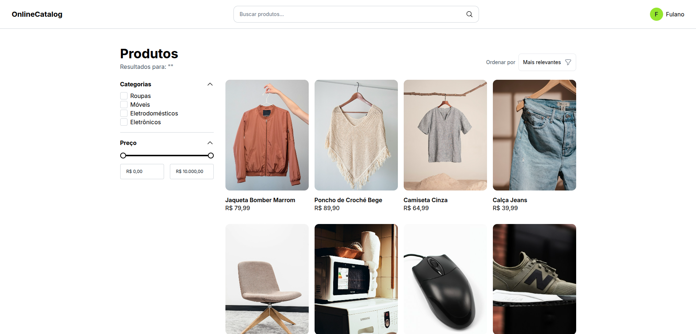
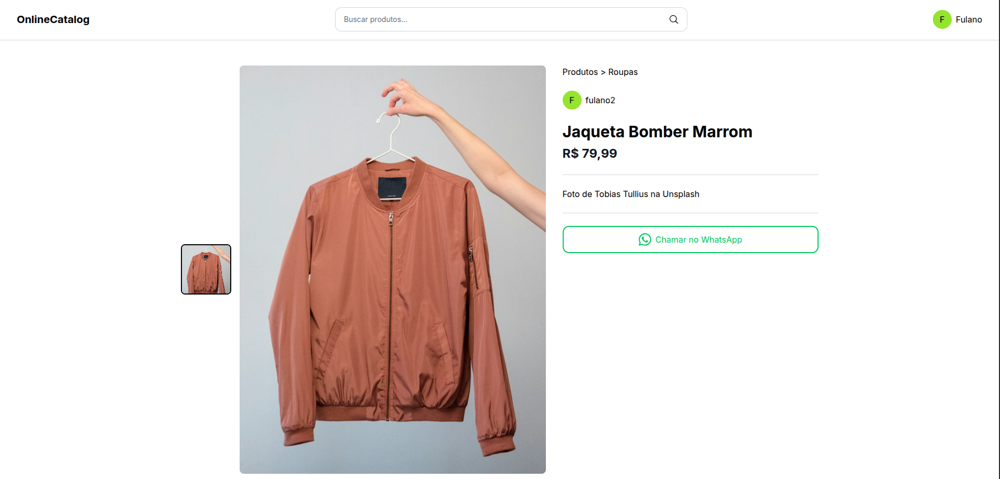
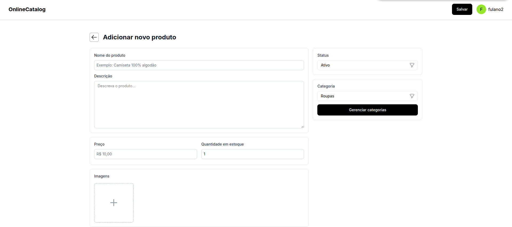
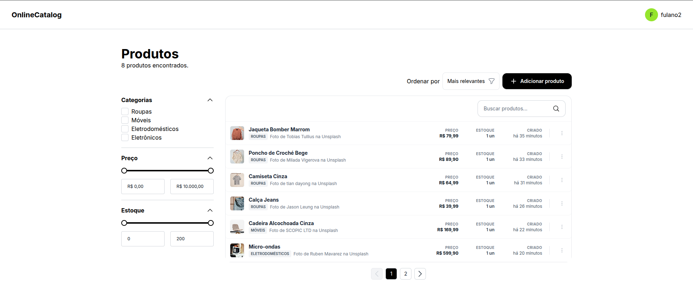
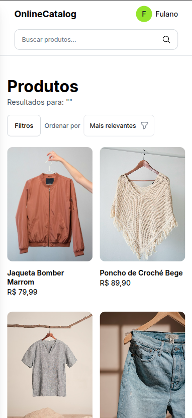
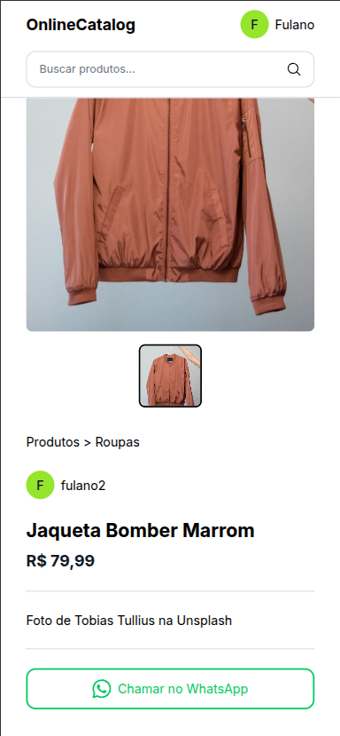
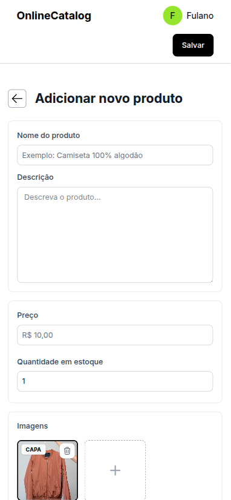
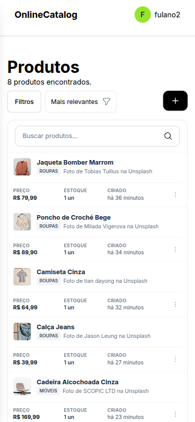

# Product Catalogue Web (`product-catalogue-web`)

A modern web application for displaying and managing a product catalogue, built with a focus on performance, responsive design, and an excellent user experience.

---

## 🌐 Live Demo

You can access and test the live application right now at:
👉 **[https://online-catalog-web.netlify.app](https://online-catalog-web.netlify.app)**


## 📱 Screenshots / Preview

<div align="center">
  <h3>Desktop Views</h3>
  
  <p><em>Products Catalogue</em></p>
  

  <p><em>Specific Product View</em></p>
  

  <p><em>Create Product</em></p>
  

  <p><em>Admin Dashboard</em></p>
  

  <hr/>

  <h3>Mobile Views</h3>
  
  <p><em>Products Catalogue</em></p>
  

  <p><em>Specific Product View</em></p>
  

  <p><em>Create Product</em></p>
  

  <p><em>Admin Dashboard</em></p>
  
</div>

---

## 🚀 Technologies Used

This project was developed using the following technologies:
* **React** / **Vite**
* **Modern CSS / Responsive Styling** (Optimized for both Desktop and Mobile devices)

---

## ⚙️ How to Run the Project

Follow the steps below to set up and run the project locally on your machine:

### Prerequisites
Make sure you have **Node.js** and a package manager (**npm** or **yarn**) installed.

### 1. Clone the repository
```bash
git clone <repository-url>
cd product-catalogue-web
```

### 2. Install dependencies
```bash
npm install
# or
yarn install
```

### 3. Configure environment variables
The project uses an `.env` file based on `.env.example`. Make sure your API endpoint is configured correctly:
```env
VITE_API_URL=http://localhost:8000
```

### 4. Run in development mode
```bash
npm run dev
# or
yarn dev
```
The application will be running at `http://localhost:5173` (or the port specified in your terminal).

---

## 📋 Todo List
- [ ] Implement user profile page
- [ ] Improve error handling and API response validation

## 🛠️ Contributing
Feel free to open *issues* or submit *pull requests* for improvements and bug fixes.

---

Made with 💻 by MarcioDzn.